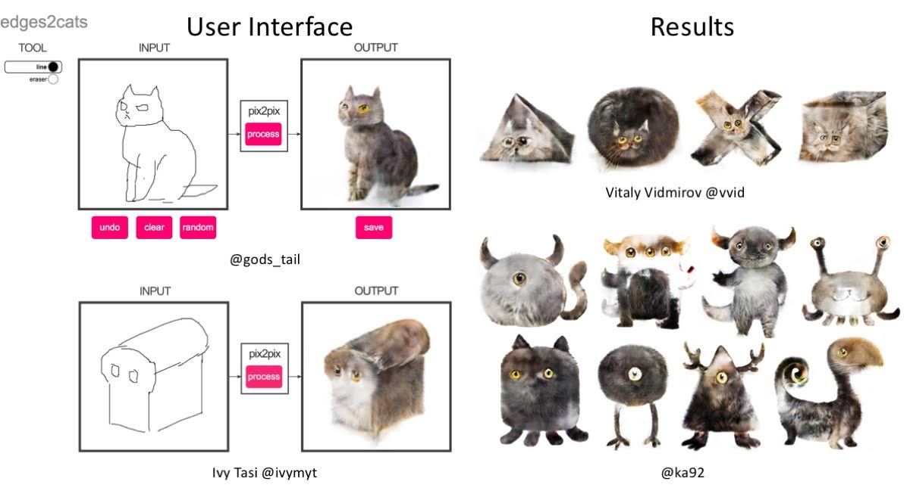

<br><br><br>

# CycleGAN and pix2pix in PyTorch

**New**:  Please check out [contrastive-unpaired-translation](https://github.com/taesungp/contrastive-unpaired-translation) (CUT), our new unpaired image-to-image translation model that enables fast and memory-efficient training.

We provide PyTorch implementations for both unpaired and paired image-to-image translation.

The code was written by [Jun-Yan Zhu](https://github.com/junyanz) and [Taesung Park](https://github.com/taesungp), and supported by [Tongzhou Wang](https://github.com/SsnL).

This PyTorch implementation produces results comparable to or better than our original Torch software. If you would like to reproduce the same results as in the papers, check out the original [CycleGAN Torch](https://github.com/junyanz/CycleGAN) and [pix2pix Torch](https://github.com/phillipi/pix2pix) code in Lua/Torch.

**Note**: The current software works well with PyTorch 1.4. Check out the older [branch](https://github.com/junyanz/pytorch-CycleGAN-and-pix2pix/tree/pytorch0.3.1) that supports PyTorch 0.1-0.3.

You may find useful information in [training/test tips](docs/tips.md) and [frequently asked questions](docs/qa.md). To implement custom models and datasets, check out our [templates](#custom-model-and-dataset). To help users better understand and adapt our codebase, we provide an [overview](docs/overview.md) of the code structure of this repository.

**CycleGAN: [Project](https://junyanz.github.io/CycleGAN/) |  [Paper](https://arxiv.org/pdf/1703.10593.pdf) |  [Torch](https://github.com/junyanz/CycleGAN) |
[Tensorflow Core Tutorial](https://www.tensorflow.org/tutorials/generative/cyclegan) | [PyTorch Colab](https://colab.research.google.com/github/junyanz/pytorch-CycleGAN-and-pix2pix/blob/master/CycleGAN.ipynb)**


**Pix2pix:  [Project](https://phillipi.github.io/pix2pix/) |  [Paper](https://arxiv.org/pdf/1611.07004.pdf) |  [Torch](https://github.com/phillipi/pix2pix) |
[Tensorflow Core Tutorial](https://www.tensorflow.org/tutorials/generative/pix2pix) | [PyTorch Colab](https://colab.research.google.com/github/junyanz/pytorch-CycleGAN-and-pix2pix/blob/master/pix2pix.ipynb)**


**[EdgesCats Demo](https://affinelayer.com/pixsrv/) | [pix2pix-tensorflow](https://github.com/affinelayer/pix2pix-tensorflow) | by [Christopher Hesse](https://twitter.com/christophrhesse)**



If you use this code for your research, please cite:

Unpaired Image-to-Image Translation using Cycle-Consistent Adversarial Networks.<br>
[Jun-Yan Zhu](https://www.cs.cmu.edu/~junyanz/)\*,  [Taesung Park](https://taesung.me/)\*, [Phillip Isola](https://people.eecs.berkeley.edu/~isola/), [Alexei A. Efros](https://people.eecs.berkeley.edu/~efros). In ICCV 2017. (* equal contributions) [[Bibtex]](https://junyanz.github.io/CycleGAN/CycleGAN.txt)


Image-to-Image Translation with Conditional Adversarial Networks.<br>
[Phillip Isola](https://people.eecs.berkeley.edu/~isola), [Jun-Yan Zhu](https://www.cs.cmu.edu/~junyanz/), [Tinghui Zhou](https://people.eecs.berkeley.edu/~tinghuiz), [Alexei A. Efros](https://people.eecs.berkeley.edu/~efros). In CVPR 2017. [[Bibtex]](https://www.cs.cmu.edu/~junyanz/projects/pix2pix/pix2pix.bib)

## Talks and Course
pix2pix slides: [keynote](http://efrosgans.eecs.berkeley.edu/CVPR18_slides/pix2pix.key) | [pdf](http://efrosgans.eecs.berkeley.edu/CVPR18_slides/pix2pix.pdf),
CycleGAN slides: [pptx](http://efrosgans.eecs.berkeley.edu/CVPR18_slides/CycleGAN.pptx) | [pdf](http://efrosgans.eecs.berkeley.edu/CVPR18_slides/CycleGAN.pdf)

CycleGAN course assignment [code](http://www.cs.toronto.edu/~rgrosse/courses/csc321_2018/assignments/a4-code.zip) and [handout](http://www.cs.toronto.edu/~rgrosse/courses/csc321_2018/assignments/a4-handout.pdf) designed by Prof. [Roger Grosse](http://www.cs.toronto.edu/~rgrosse/) for [CSC321](http://www.cs.toronto.edu/~rgrosse/courses/csc321_2018/) "Intro to Neural Networks and Machine Learning" at University of Toronto. Please contact the instructor if you would like to adopt it in your course.

## Colab Notebook
TensorFlow Core CycleGAN Tutorial: [Google Colab](https://colab.research.google.com/github/tensorflow/docs/blob/master/site/en/tutorials/generative/cyclegan.ipynb) | [Code](https://github.com/tensorflow/docs/blob/master/site/en/tutorials/generative/cyclegan.ipynb)

TensorFlow Core pix2pix Tutorial: [Google Colab](https://colab.research.google.com/github/tensorflow/docs/blob/master/site/en/tutorials/generative/pix2pix.ipynb) | [Code](https://github.com/tensorflow/docs/blob/master/site/en/tutorials/generative/pix2pix.ipynb)

PyTorch Colab notebook: [CycleGAN](https://colab.research.google.com/github/junyanz/pytorch-CycleGAN-and-pix2pix/blob/master/CycleGAN.ipynb) and [pix2pix](https://colab.research.google.com/github/junyanz/pytorch-CycleGAN-and-pix2pix/blob/master/pix2pix.ipynb)

ZeroCostDL4Mic Colab notebook: [CycleGAN](https://colab.research.google.com/github/HenriquesLab/ZeroCostDL4Mic/blob/master/Colab_notebooks_Beta/CycleGAN_ZeroCostDL4Mic.ipynb) and [pix2pix](https://colab.research.google.com/github/HenriquesLab/ZeroCostDL4Mic/blob/master/Colab_notebooks_Beta/pix2pix_ZeroCostDL4Mic.ipynb)

## Other implementations
### CycleGAN
<p><a href="https://github.com/leehomyc/cyclegan-1"> [Tensorflow]</a> (by Harry Yang),
<a href="https://github.com/architrathore/CycleGAN/">[Tensorflow]</a> (by Archit Rathore),
<a href="https://github.com/vanhuyz/CycleGAN-TensorFlow">[Tensorflow]</a> (by Van Huy),
<a href="https://github.com/XHUJOY/CycleGAN-tensorflow">[Tensorflow]</a> (by Xiaowei Hu),
<a href="https://github.com/LynnHo/CycleGAN-Tensorflow-2"> [Tensorflow2]</a> (by Zhenliang He),
<a href="https://github.com/luoxier/CycleGAN_Tensorlayer"> [TensorLayer1.0]</a> (by luoxier),
<a href="https://github.com/tensorlayer/cyclegan"> [TensorLayer2.0]</a> (by zsdonghao),
<a href="https://github.com/Aixile/chainer-cyclegan">[Chainer]</a> (by Yanghua Jin),
<a href="https://github.com/yunjey/mnist-svhn-transfer">[Minimal PyTorch]</a> (by yunjey),
<a href="https://github.com/Ldpe2G/DeepLearningForFun/tree/master/Mxnet-Scala/CycleGAN">[Mxnet]</a> (by Ldpe2G),
<a href="https://github.com/tjwei/GANotebooks">[lasagne/Keras]</a> (by tjwei),
<a href="https://github.com/simontomaskarlsson/CycleGAN-Keras">[Keras]</a> (by Simon Karlsson),
<a href="https://github.com/Ldpe2G/DeepLearningForFun/tree/master/Oneflow-Python/CycleGAN">[OneFlow]</a> (by Ldpe2G)
</p>
</ul>

### pix2pix
<p><a href="https://github.com/affinelayer/pix2pix-tensorflow"> [Tensorflow]</a> (by Christopher Hesse),
<a href="https://github.com/Eyyub/tensorflow-pix2pix">[Tensorflow]</a> (by Eyyüb Sariu),
<a href="https://github.com/datitran/face2face-demo"> [Tensorflow (face2face)]</a> (by Dat Tran),
<a href="https://github.com/awjuliani/Pix2Pix-Film"> [Tensorflow (film)]</a> (by Arthur Juliani),
<a href="https://github.com/kaonashi-tyc/zi2zi">[Tensorflow (zi2zi)]</a> (by Yuchen Tian),
<a href="https://github.com/pfnet-research/chainer-pix2pix">[Chainer]</a> (by mattya),
<a href="https://github.com/tjwei/GANotebooks">[tf/torch/keras/lasagne]</a> (by tjwei),
<a href="https://github.com/taey16/pix2pixBEGAN.pytorch">[Pytorch]</a> (by taey16)
</p>
</ul>

## Prerequisites
- Linux or macOS
- Python 3
- CPU or NVIDIA GPU + CUDA CuDNN

## Getting Started
### Installation

- Clone this repo:
```bash
git clone https://github.com/junyanz/pytorch-CycleGAN-and-pix2pix
cd pytorch-CycleGAN-and-pix2pix
```

- Install [PyTorch](http://pytorch.org) and 0.4+ and other dependencies (e.g., torchvision, [visdom](https://github.com/facebookresearch/visdom) and [dominate](https://github.com/Knio/dominate)).
  - For pip users, please type the command `pip install -r requirements.txt`.
  - For Conda users, you can create a new Conda environment using `conda env create -f environment.yml`.
  - For Docker users, we provide the pre-built Docker image and Dockerfile. Please refer to our [Docker](docs/docker.md) page.
  - For Repl users, please click [](https://repl.it/github/junyanz/pytorch-CycleGAN-and-pix2pix).

### CycleGAN train/test
- Download a CycleGAN dataset (e.g. maps):
```bash
bash ./datasets/download_cyclegan_dataset.sh maps
```
- To view training results and loss plots, run `python -m visdom.server` and click the URL http://localhost:8097.
- Train a model:
```bash
#!./scripts/train_cyclegan.sh
python train.py --dataroot ./datasets/maps --name maps_cyclegan --model cycle_gan
```
To see more intermediate results, check out `./checkpoints/maps_cyclegan/web/index.html`.
- Test the model:
```bash
#!./scripts/test_cyclegan.sh
python test.py --dataroot ./datasets/maps --name maps_cyclegan --model cycle_gan
```
- The test results will be saved to a html file here: `./results/maps_cyclegan/latest_test/index.html`.

### pix2pix train/test
- Download a pix2pix dataset (e.g.[facades](http://cmp.felk.cvut.cz/~tylecr1/facade/)):
```bash
bash ./datasets/download_pix2pix_dataset.sh facades
```
- To view training results and loss plots, run `python -m visdom.server` and click the URL http://localhost:8097.
- Train a model:
```bash
#!./scripts/train_pix2pix.sh
python train.py --dataroot ./datasets/facades --name facades_pix2pix --model pix2pix --direction BtoA
```
To see more intermediate results, check out  `./checkpoints/facades_pix2pix/web/index.html`.

- Test the model (`bash ./scripts/test_pix2pix.sh`):
```bash
#!./scripts/test_pix2pix.sh
python test.py --dataroot ./datasets/facades --name facades_pix2pix --model pix2pix --direction BtoA
```
- The test results will be saved to a html file here: `./results/facades_pix2pix/test_latest/index.html`. You can find more scripts at `scripts` directory.
- To train and test pix2pix-based colorization models, please add `--model colorization` and `--dataset_mode colorization`. See our training [tips](https://github.com/junyanz/pytorch-CycleGAN-and-pix2pix/blob/master/docs/tips.md#notes-on-colorization) for more details.

### Apply a pre-trained model (CycleGAN)
- You can download a pretrained model (e.g. horse2zebra) with the following script:
```bash
bash ./scripts/download_cyclegan_model.sh horse2zebra
```
- The pretrained model is saved at `./checkpoints/{name}_pretrained/latest_net_G.pth`. Check [here](https://github.com/junyanz/pytorch-CycleGAN-and-pix2pix/blob/master/scripts/download_cyclegan_model.sh#L3) for all the available CycleGAN models.
- To test the model, you also need to download the  horse2zebra dataset:
```bash
bash ./datasets/download_cyclegan_dataset.sh horse2zebra
```

- Then generate the results using
```bash
python test.py --dataroot datasets/horse2zebra/testA --name horse2zebra_pretrained --model test --no_dropout
```
- The option `--model test` is used for generating results of CycleGAN only for one side. This option will automatically set `--dataset_mode single`, which only loads the images from one set. On the contrary, using `--model cycle_gan` requires loading and generating results in both directions, which is sometimes unnecessary. The results will be saved at `./results/`. Use `--results_dir {directory_path_to_save_result}` to specify the results directory.

- For pix2pix and your own models, you need to explicitly specify `--netG`, `--norm`, `--no_dropout` to match the generator architecture of the trained model. See this [FAQ](https://github.com/junyanz/pytorch-CycleGAN-and-pix2pix/blob/master/docs/qa.md#runtimeerror-errors-in-loading-state_dict-812-671461-296) for more details.

### Apply a pre-trained model (pix2pix)
Download a pre-trained model with `./scripts/download_pix2pix_model.sh`.

- Check [here](https://github.com/junyanz/pytorch-CycleGAN-and-pix2pix/blob/master/scripts/download_pix2pix_model.sh#L3) for all the available pix2pix models. For example, if you would like to download label2photo model on the Facades dataset,
```bash
bash ./scripts/download_pix2pix_model.sh facades_label2photo
```
- Download the pix2pix facades datasets:
```bash
bash ./datasets/download_pix2pix_dataset.sh facades
```
- Then generate the results using
```bash
python test.py --dataroot ./datasets/facades/ --direction BtoA --model pix2pix --name facades_label2photo_pretrained
```
- Note that we specified `--direction BtoA` as Facades dataset's A to B direction is photos to labels.

- If you would like to apply a pre-trained model to a collection of input images (rather than image pairs), please use `--model test` option. See `./scripts/test_single.sh` for how to apply a model to Facade label maps (stored in the directory `facades/testB`).

- See a list of currently available models at `./scripts/download_pix2pix_model.sh`

## [Docker](docs/docker.md)
We provide the pre-built Docker image and Dockerfile that can run this code repo. See [docker](docs/docker.md).

## [Datasets](docs/datasets.md)
Download pix2pix/CycleGAN datasets and create your own datasets.

## [Training/Test Tips](docs/tips.md)
Best practice for training and testing your models.

## [Frequently Asked Questions](docs/qa.md)
Before you post a new question, please first look at the above Q & A and existing GitHub issues.

## Custom Model and Dataset
If you plan to implement custom models and dataset for your new applications, we provide a dataset [template](data/template_dataset.py) and a model [template](models/template_model.py) as a starting point.

## [Code structure](docs/overview.md)
To help users better understand and use our code, we briefly overview the functionality and implementation of each package and each module.

## Pull Request
You are always welcome to contribute to this repository by sending a [pull request](https://help.github.com/articles/about-pull-requests/).
Please run `flake8 --ignore E501 .` and `python ./scripts/test_before_push.py` before you commit the code. Please also update the code structure [overview](docs/overview.md) accordingly if you add or remove files.

## Citation
If you use this code for your research, please cite our papers.
```
@inproceedings{CycleGAN2017,
  title={Unpaired Image-to-Image Translation using Cycle-Consistent Adversarial Networks},
  author={Zhu, Jun-Yan and Park, Taesung and Isola, Phillip and Efros, Alexei A},
  booktitle={Computer Vision (ICCV), 2017 IEEE International Conference on},
  year={2017}
}


@inproceedings{isola2017image,
  title={Image-to-Image Translation with Conditional Adversarial Networks},
  author={Isola, Phillip and Zhu, Jun-Yan and Zhou, Tinghui and Efros, Alexei A},
  booktitle={Computer Vision and Pattern Recognition (CVPR), 2017 IEEE Conference on},
  year={2017}
}
```

## Other Languages
[Spanish](docs/README_es.md)

## Related Projects
**[contrastive-unpaired-translation](https://github.com/taesungp/contrastive-unpaired-translation) (CUT)**<br>
**[CycleGAN-Torch](https://github.com/junyanz/CycleGAN) |
[pix2pix-Torch](https://github.com/phillipi/pix2pix) | [pix2pixHD](https://github.com/NVIDIA/pix2pixHD)|
[BicycleGAN](https://github.com/junyanz/BicycleGAN) | [vid2vid](https://tcwang0509.github.io/vid2vid/) | [SPADE/GauGAN](https://github.com/NVlabs/SPADE)**<br>
**[iGAN](https://github.com/junyanz/iGAN) | [GAN Dissection](https://github.com/CSAILVision/GANDissect) | [GAN Paint](http://ganpaint.io/)**

## Cat Paper Collection
If you love cats, and love reading cool graphics, vision, and learning papers, please check out the Cat Paper [Collection](https://github.com/junyanz/CatPapers).

## Acknowledgments
Our code is inspired by [pytorch-DCGAN](https://github.com/pytorch/examples/tree/master/dcgan).
